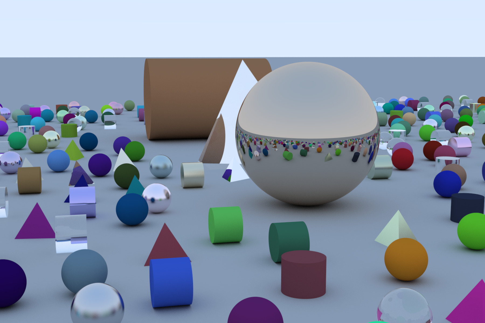
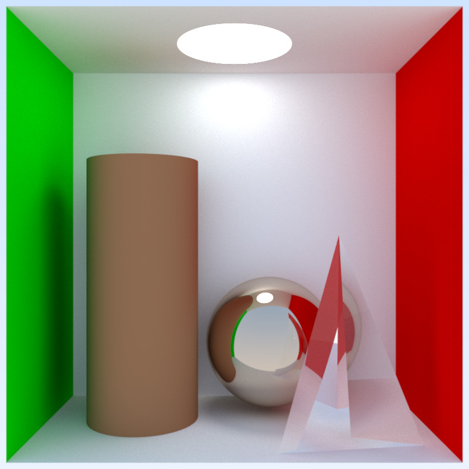
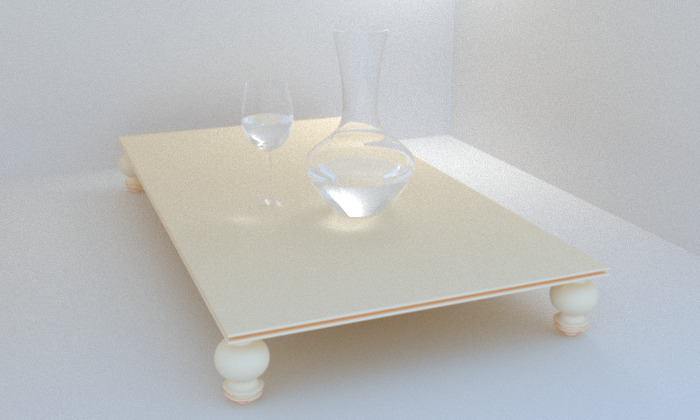
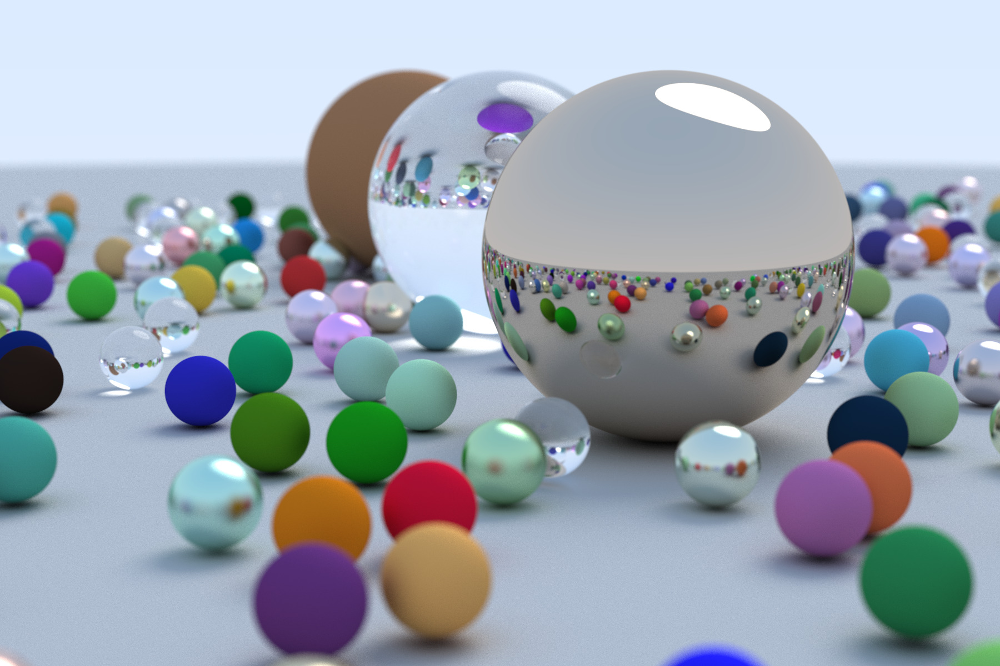

# simple-ray-tracer
A simple ray tracer implementation for the graphics course at NJU. Basically it supports different geometries and materials, and the following is one example: 

And more examples:

