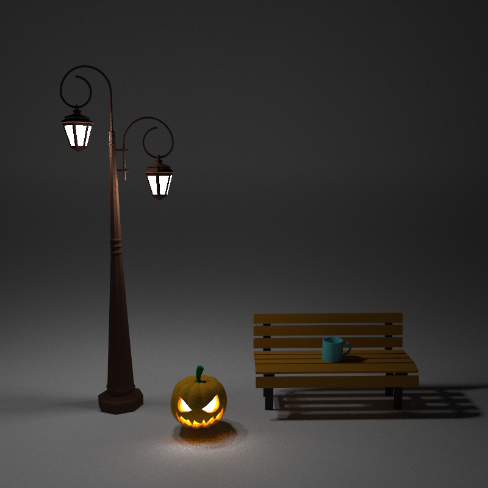
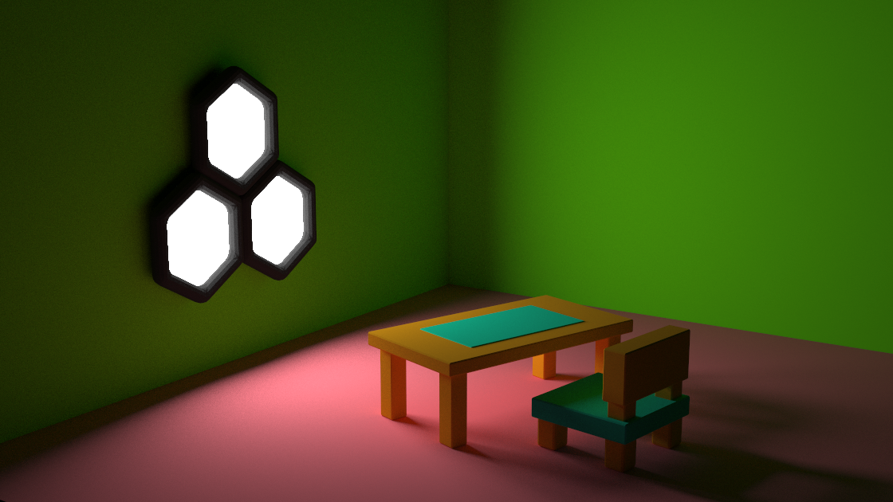
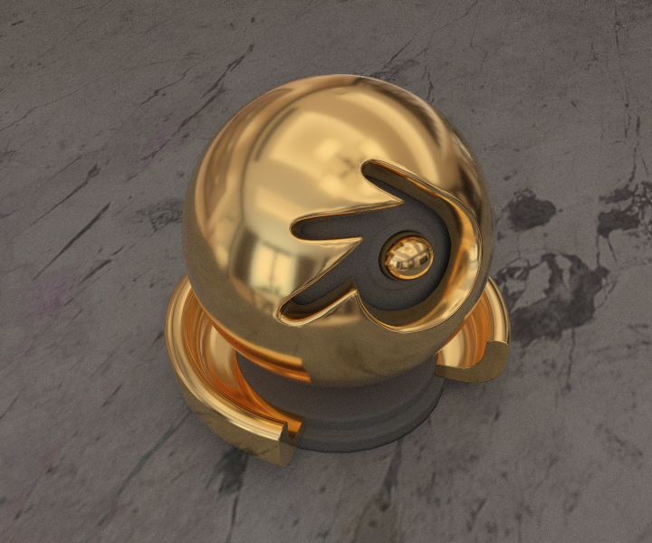
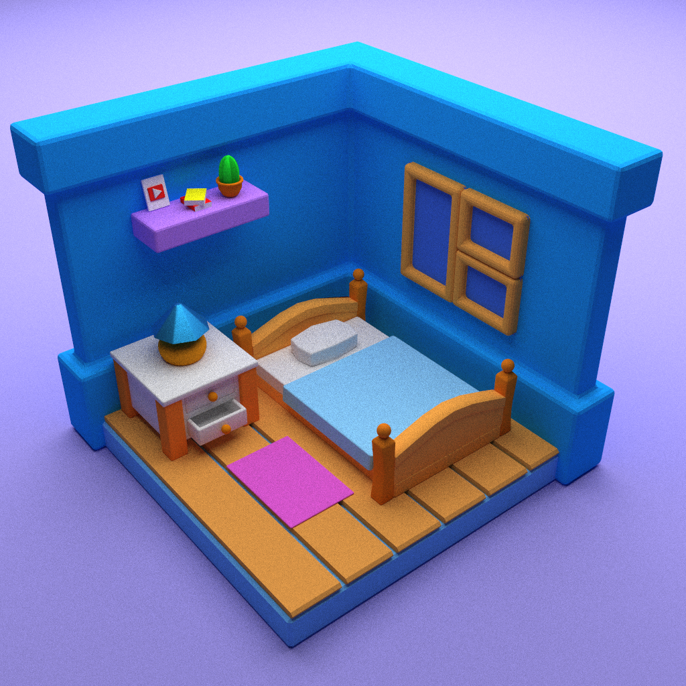
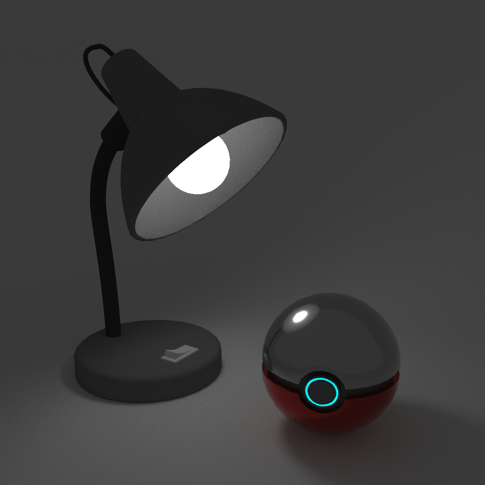
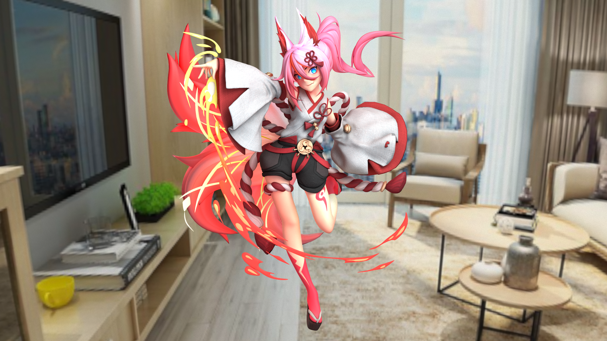

# PathTracer

This is a simple renderer written in C++ without using any 3rd party libraries. It was originally used for my graphics course assignment, and is left here as a souvenir. The whole program is based on the rendering equation proposed by Jim Kajiya at 1986, and currently supports the following features: 

* Solve the rendering equation using Path Tracing

* Accelerate the computation using BVH and multithreading

* The simplest material Lambertian, and a slightly complicated one: 

* Microfacet BRDF using GGX distribution

* Image Texture using bilinear interpolation

* Importance sampling including light sampling, BRDF sampling and

* Multiple Importance Sampling（MIS）

* Load 3D models in arbitrary shape from .obj file（only the geometry）, using triangle mesh

* ......

Although various bugs have been fixed，the code is still functionally limited. 

Here are some examples rendered with the simple path tracer: 

    

        
        
roughness = 0.15

	

    

        
        
roughness = 0.35

	

    

        
        
roughness = 0.55

	

    

        
        
roughness = 0.75

	

    bmps 720x600, spp 512

