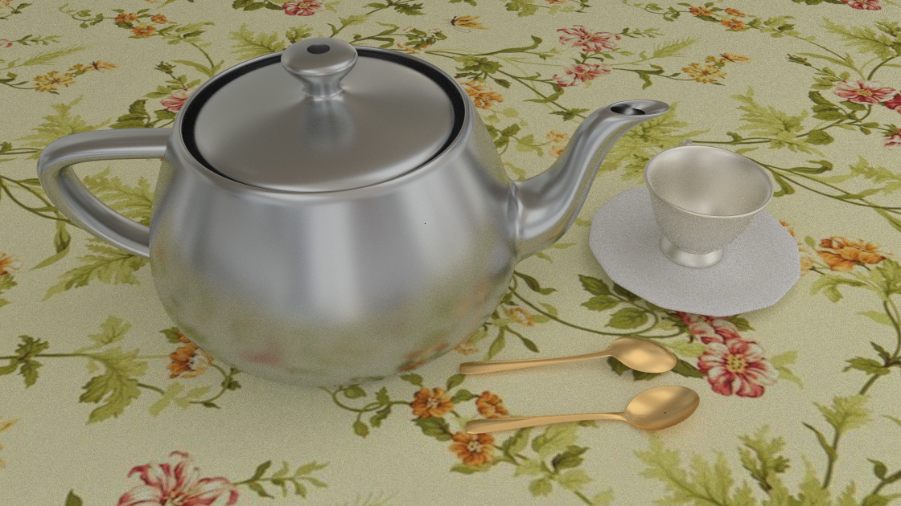

# PathTracer Example

This is a simple renderer written in C++ without using any 3rd party libraries. It was originally used for my graphics course assignment, and is left here as a souvenir. The whole program is based on the rendering equation proposed by Jim Kajiya at 1986, and currently supports the following features: 

* Solve the rendering equation using Path Tracing

* Accelerate the computation using BVH and multithreading

* The simplest material Lambertian, and a slightly complicated one: 

* Microfacet BRDF using GGX distribution

* Image Texture Mapping using bilinear interpolation

* Importance sampling including light sampling, BRDF sampling and

* Multiple Importance Sampling（MIS）

* Load 3D models from .obj file（only the geometry, normals and UVs, using triangle mesh）

* Read/Write with .ppm image format（does not support comments）

* ......

Although various bugs have been fixed，the code is still functionally limited. Originally there were some test cases, but I removed them later in a major refactoring. The principles and formulas involved in the code can be found everywhere on the Internet, since most of them were developed more than 20 years ago.

Here are some examples rendered with the simple path tracer: 

     
    street 800x800, spp 512

     
    desk 1120x630, spp 512

     
    bmps 720x600, spp 512, roughness = 0.15

     
    bedroom 1024x1024, spp 512

     
    poke 1024x1024, spp 512

     
    teapot 1120x630, spp 512

     
    Higokumaru 1920x1080, spp 512

Some of the models were built by myself based on Youtube tutorials; Others were downloaded from [Blender Swap](https://www.blendswap.com/). The Higokumaru model can be found [here](https://sketchfab.com/tags/honkai); The author also has a work for [Darkbolt Jonin](https://www.artstation.com/mookorea), but I don't know how to download it（Ha ha）. 
